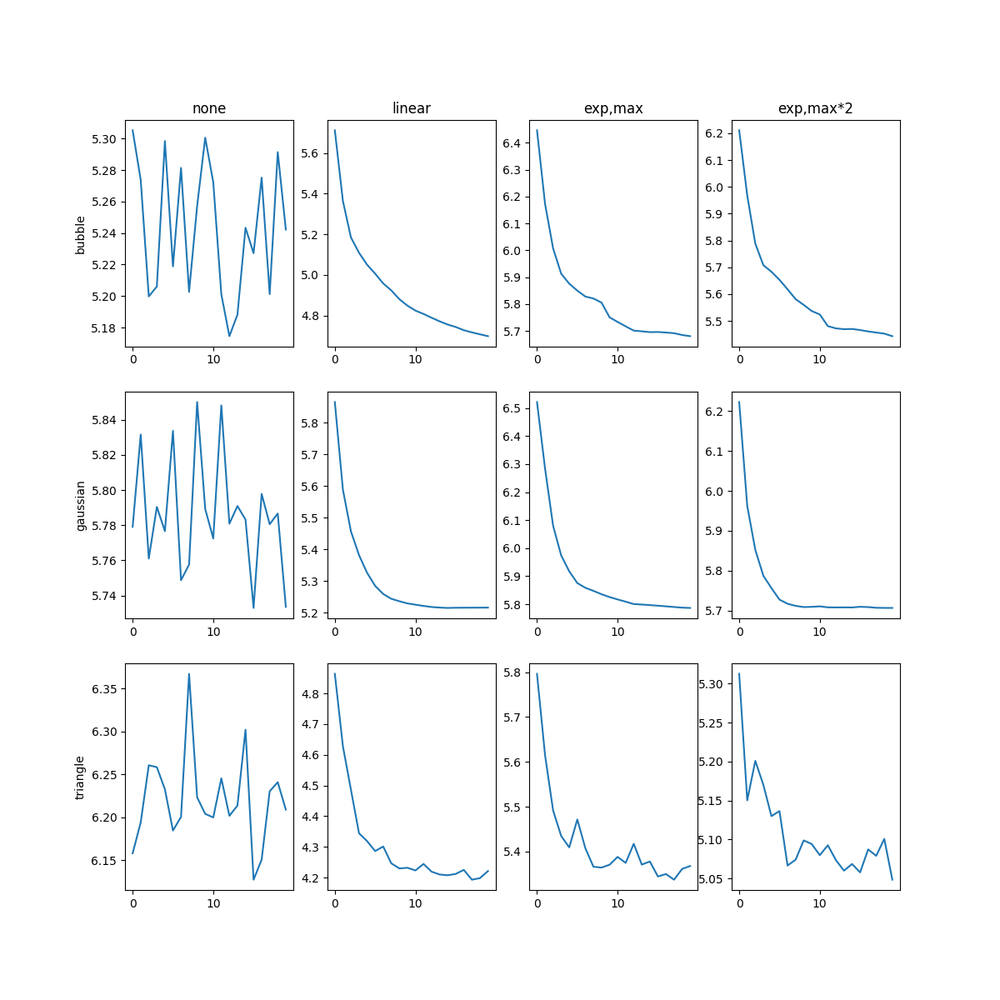
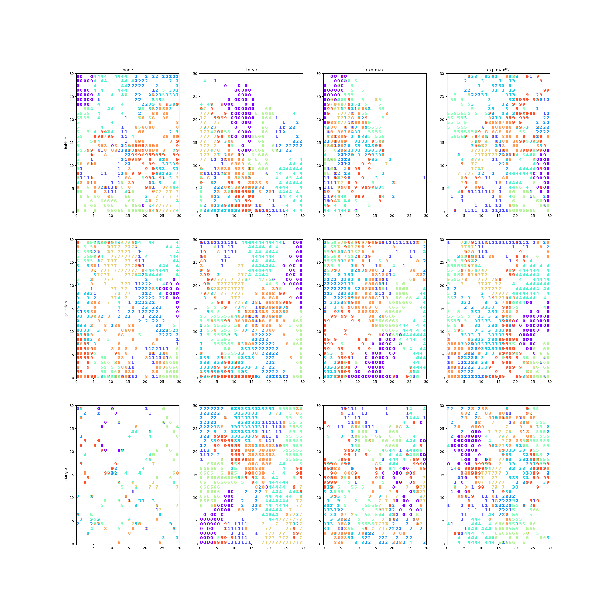

<h2 align="center">✨ Self-Organized-Map (SOM)</h2>

<div align="center"><a href="README-en.md">--> Readme.md in English <--</a></div>

来自机器学习第六次实验~

实现了统一接口，注释比较多，新手友好~

欢迎issue或者pr，如果帮到了你也欢迎点个star~

### 目录结构

目录中包含三个单独的运行文件，在`main.py`文件中可以直接运行进行单次训练（包含可视化），在`demo.py`以及`visualize.py`中为对不同窗函数和学习率下降策略的对比试验可视化。

```tree
│  .gitignore
│  demo.py # 12次实验训练模型效果可视化
│  ErrorVisualize.png
│  main.py # 单次训练
│  NumVisualize.png
│  README.md
│  visualize.py # 12次实验训练误差下降曲线可视化
└─ SOM
    │  Distance.py # 距离函数
    │  model.py # SOM模型主体
    │  Neighbor.py # 窗函数
    └─  __init__.py
```

### 效果

从左到右每一列分别为：

* 不使用学习率下降策略
* 使用线性学习率下降策略
* 使用指数学习率下降策略，且分母为最大迭代次数
* 使用指数学习率下降策略，且分母为最大迭代次数的两倍

从上到下每一行分别为：

* 使用bubble窗函数
* 使用高斯窗函数
* 使用Triangle窗函数





### License

GPL
